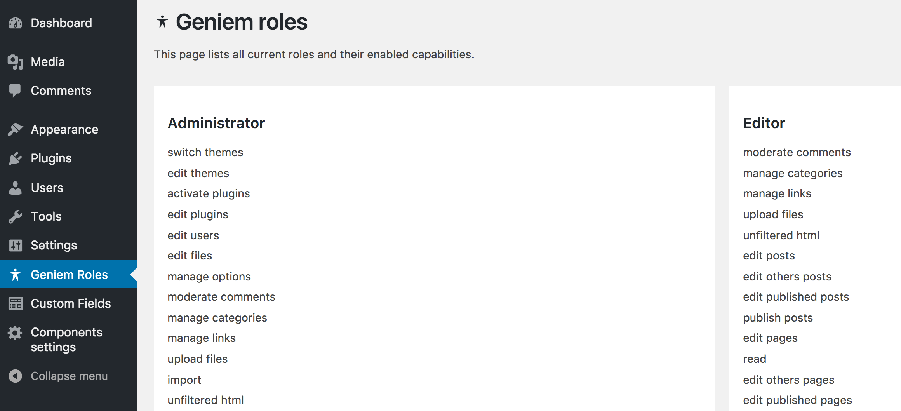

# Geniem Roles
Wrapper classes for developers to create and manipulate WordPress roles.

## Composer installation
command line
```
composer require devgeniem/wp-geniem-roles
```
composer.json
```json
...
"require": {
    "devgeniem/wp-geniem-roles": "*",
    ...
}
...
```

## Manual installation
Move plugin to your WordPress installation `plugins/` folder.

# Examples

## Initializing Geniem Roles
Geniem roles plugin has been designed in singleton architecture. Singleton is created inside the plugin. After plugin has been activated you are able to use Geniem roles functions.
It is still good practice to check that plugin has been activated.

```php
// If wp-geniem-roles is active.
if ( class_exists( '\Geniem\Roles' ) ) {
    // Run Geniem roles functions here.
}
```

## Create a new role with capabilities
All new roles capabilities defaults to `false`. So we add just capabilities that we want to apply for the role. See the example code for a hands on example.

```php
/**
 * Create a new role
 */

// Caps to be added to the new role
// all caps default to false see the details plugin.php \Geniem\Role::get_default_caps()
$new_role_caps = array(
    "activate_plugins"    => true,
    "delete_others_pages" => true,
    "delete_others_posts" => true,
);

// Create a new role "testrole" with wanted capabilities
$new_role = \Geniem\Roles::create( 'new_role', __( 'New role', 'theme-text-domain' ), $new_role_caps );

// Check if role throws a WordPress error
if ( is_wp_error( $new_role ) ) {
    error_log( $new_role->get_error_messages() );
}
```

## Development guidelines
User roles are stored in the database so you need to reset roles in the database after changes to the roles. This can be done with wp-geniem-roles or wp cli.

### Reset roles with wp-geniem-roles
wp-geniem-roles resets WordPress standard and custom roles with one method.
Note this is a slow process you don't want to run this on every page load.
Helper function for debugging and controlled reseting of the roles.
```php
\Geniem\Roles::reset_roles();
```

### Reset roles to WordPress default roles
wp-geniem-roles resets all roles to WordPress default ones with one method.
```php
\Geniem\Roles::reset_to_default_roles();
```

### Reset roles on multisite with WP CLI
Reset roles on multisite with CLI command. This resets all default roles and also all custom roles.
```wp eval "\Geniem\Roles::reset_roles();"```

### WP CLI reset roles.
You can also reset roles with WP CLI see the documentation from here.
https://developer.wordpress.org/cli/commands/role/

## Get and manipulate a role
You can call existing role from WordPress by calling function `\Geniem\Roles::get( $role_slug );`. You can use a role as an object to manipulate the role. See the example from the below.

```php
// Gets a role instance of \Geniem\Roles
$admin = \Geniem\Roles::get( 'administrator' );
```

### Add caps for a role
```php
// Define desired capabilities for a role 'administrator'
$admin_caps = [
    'geniem_roles'
];

// add_caps takes an array off capabilities
$admin->add_caps( $admin_caps );
```

### Remove caps from a role
```php
// Define removable caps in an array
$admin_removable_caps = [
    'edit_users',
    'delete_users',
    'create_users'
];

// Run function remove_caps for desired wp role
$admin->remove_caps( $admin_removable_caps );
```

### Remove a role.
```php
// Get a role.
$author = \Geniem\Roles::get( 'author' );

// If role is removed successfully this will cause an error on the next page load. 
if ( $author ) {
    // Remove a role
    $author->remove();
}
```

### Rename a role.
```php
// Rename a role
$author->rename( 'New name' );
```

### Remove menu pages from a role
You can remove single admin menu page with `string` value or multiple pages with an `array` value. You can also remove submenu pages. See the example below for the details.
```php
/**
 * Define removable admin pages array
 *
 * note: Most of the plugins can be removed by plugin page slug.
 * Geniem roles lists all menu slugs in the admin page [Geniem Roles -> Menu slugs].
 *
 */
$admin_removable_admin_pages = [
    'edit.php',                             // Posts
    'edit.php?post_type=page',              // Pages
    'edit.php?post_type=acf-field-group'    // Advanced Custom Fields
    'plugin_page_slug',                     // Remove plugin page by plugin page slug
    // You can also remove submenu pages like so.
    'themes.php' => [
        'themes.php',
        // Note geniem roles has automated feature to remove 'customize.php' with ease.
        // No need for usually required query parameters.
        'customize.php',
    ],
];

// Remove multiple menu pages remove_role_menu_pages( $role_slug, $menu_pages )
$admin->remove_menu_pages( $admin_removable_admin_pages );
```
### Remove admin bar nodes by a role
You can remove admin bar nodes by a role with a function `remove_admin_bar_nodes()`. See the example below for the details.
```php
/**
 * Define removable admin bar nodes.
 */
$admin_removable_admin_bar_nodes = [
    'new-post', // Default post type 'post' add new button.
];

$admin->remove_admin_bar_nodes( $admin_removable_admin_bar_nodes );
```

### Restrict post editing and deleting
This function makes easy and fast to restrict editing of certain posts. Pass restricted post as an array of post ids and choose which capabilities you want to restrict for them.

```php
/**
* All possible restricted capabilities are listed below
* https://codex.wordpress.org/Function_Reference/map_meta_cap
*/
'delete_page'
'delete_post'
'delete_user'
'edit_comment' (3.1. Mapped to 'edit_post' meta capability.)
'edit_page'
'edit_post'
'edit_user'
'publish_post' (3.5)
'promote_user'
'read_post'
'read_page'
'remove_user'
```

```php
// Define restricted post IDs
$frontpage_id = (int) get_option( 'page_on_front' );

$restricted_posts = [
    $frontpage_id,
    2
];

// Restricted capabilities for the post.
$capabilities = [
    'delete_post',
    'edit_post',
];

$admin->restrict_post_edit( $restricted_posts, $capabilities );
```

### Grant post editing
This function makes easy and fast to grant posts by the given post ids and capabilities.
Note you can also define caps for the other posts if not defined all caps will be blocked for the other posts.

```php
/**
* All possible restricted capabilities are listed below
* https://codex.wordpress.org/Function_Reference/map_meta_cap
*/
'delete_page'
'delete_post'
'delete_user'
'edit_comment' (3.1. Mapped to 'edit_post' meta capability.)
'edit_page'
'edit_post'
'edit_user'
'publish_post' (3.5)
'promote_user'
'read_post'
'read_page'
'remove_user'
```

```php
// Define restricted post IDs
$frontpage_id = (int) get_option( 'page_on_front' );

$granted_post_ids = [
    $frontpage_id,
    2
];

// Allow edit_post cap for granted posts.
$granted_posts_caps = [
    'edit_post',
];

// If empty all caps will be blocked.
// Here we are allowing delete_post cap for other posts than $granted_post_ids. (optional)
$restricted_posts_caps = [
    'delete_post',
];

// Post types to restrict. If defined other post types won't be handled. (optional)
$post_types = [ 'page' ];

$admin->grant_post_edit( $granted_post_ids, $granted_posts_caps, $restricted_posts_caps, $post_types );
```

### Restrict user management by role
Function to restrict users to manage users by the given roles and capabilities.
Role will be removed from the WordPress admin user management dropdowns for example bulk action "Change role to" if the role has been restricted with the caps `edit_user` or `promote_user`.

```php
/**
 * Associative array of removed caps by the role.
 * $key = User role to be restricted from the role.
 * $value = Array of removed caps from the role.
 * 
 * All possible user editing caps has been listed below:
 * 'edit_user'
 * 'delete_user'
 * 'promote_user'
 * 'remove_user'
 */
$custom_role_restricted_user_roles = [
    // Role
    'administrator' => [
        // Removed caps.
        'edit_user',
        'delete_user',
        'remove_user',
    ],
    // Another role
    'editor' => [
        'delete_user',
    ],
];

$custom_role->restrict_user_management_by_role( $custom_role_restricted_user_roles );
```

### Restrict user template management by role
Function to restrict roles available templates. Add only templates that you want to enable.
Array of slugs will be used ass a parameter. (You can inspect template slug from the wp-admin template dropdown.)
`Note!: WordPress doesn't handle default template the same way as other templates.
Default template will always be available for the users. If you want to enable only default template add string 'default' as a parameter.`

```php
    // Example 1
    // Allow only default template for the user.
    $role->restrict_role_templates( 'default' );
```

```php
    // Example 2 allow
    // page-frontpage.php and default template for the user.
    $allowed_templates = [
        'page-frontpage.php',
    ];

    $role->restrict_role_templates( $allowed_templates );
```

### Grant super admin cap for a single user
```php
\Geniem\Roles::grant_super_admin_cap( 1 );
```

# Filters
## 'geniem/roles/add_menu_page_cap'
Change wp-geniem-roles wp-admin menu capability.
- Default value: `'activate_plugins'`
- Parameter type: `string`

### Example usage
```php
/**
 * Filter wp-geniem-roles menu page capability.
 *
 * @return string WordPress capability.
 */
function filter_geniem_roles_menu_page_cap( $menu_page_cap ) {

    return 'manage_options';
}

\add_filter( 'geniem/roles/add_menu_page_cap', 'filter_geniem_roles_menu_page_cap' );
```
## 'geniem/roles/default_roles'
Filter new role default capabilities.
- Default value: `By default Geniem Roles defines all capabilities to false.`
- Parameter type: `array`
### Example usage
```php
/**
 * Filter wp-geniem-roles default capabilities for the new role.
 *
 * @return array An array of capabilities to be added to the new role automatically.
 */
function filter_geniem_roles_default_caps( $default_caps ) {

    $default_caps = [
        'edit_posts' => true,
    ];

    return $default_caps;
}

\add_filter( 'geniem/roles/default_roles', 'filter_geniem_roles_default_caps' );
```

# Admin page role listing
`wp-geniem-roles` creates a admin page which lists all current active roles and their capabilities in the admin side. Admin page can be seen for roles that can `can_activate_plugins`.

#### screenshot


# Admin page menu slugs
`wp-geniem-roles` creates a admin page which lists all menu slugs. This is helper page for usage of function `remove_menu_pages()`. See the function documentation for more information.

# Roles on network installation
WordPress documentation for user management capabilities on network is fragmented. We have listed here some nice to know information.

## create_users capability on network
If you have created custom roles that can create new users for the site note that you also need to enable network site option "Add New Users" (`add_new_users` on database). The setting can be found from the wp-admin settings page https://sitedomain.com/wp-admin/network/settings.php.
